<div align="center">

# 🛡️ PhishGuard
### Advanced AI-Powered Phishing Protection Suite

[](https://nextjs.org/)
[](https://www.typescriptlang.org/)
[](https://firebase.google.com/)
[](https://python.org/)
[](https://fastapi.tiangolo.com/)

*Protecting students and professionals from cyber threats with cutting-edge AI technology*

## 👥 Team

This project was built by:

- Shivaan
- Shannon

</div>

---

## 🌟 **What is PhishGuard?**

PhishGuard is a comprehensive cybersecurity platform designed specifically for **students and educational institutions**. Using advanced AI and machine learning, we provide real-time protection against phishing emails, malicious links, and sophisticated scams targeting the academic community.

### ✨ **Key Features**

🔗 **Smart Link Scanner** - AI-powered URL analysis with real-time threat detection  
📧 **Email Security** - Advanced phishing email detection and filtering  
📄 **Document Analysis** - Scan PDFs and documents for malicious content  
🎓 **Educational Hub** - Interactive cybersecurity courses and awareness training  
💬 **Expert Chat Support** - Real-time Q&A with cybersecurity professionals  
📊 **University Dashboard** - Institution-wide security analytics and reporting  
🏆 **Gamified Learning** - Points, badges, and achievements for security education  

---

## � New Features

We've added several new tools to make PhishGuard more useful and interactive. Below is a quick summary, where to find the code, and how to try them locally.

### QR Code Scanner (/qr-scan)
- What: Upload an image (PNG/JPG) that contains a QR code. The app decodes the QR and extracts URLs or text content.
- Files: `phishguard/app/qr-scan/page.tsx`, `phishguard/components/ScannerForm.tsx` (used by the page).
- Backend API: FastAPI router at `ml_model/app/routers/qr_router.py` exposes POST /api/qr/scan which accepts an image file and returns the decoded QR result.
- Try it: Start the frontend (http://localhost:3000) and backend (http://localhost:8000). Open http://localhost:3000/qr-scan and upload a QR image.
- Note: The frontend `ScannerForm` currently sends requests to `http://localhost:8000/scan/qr/api/qr/scan` in the page — make sure the URL matches your backend routing (the backend route is `POST /api/qr/scan`).

### Admin Chat — Team Lead Dashboard (/admin-chat)
- What: A real-time admin dashboard for team leads to view and answer student questions submitted from the student chat. Includes stats, filtering, priority/status labels, and the ability to mark answers.
- Files: `phishguard/app/admin-chat/page.tsx`.
- Auth: The page checks an `ADMIN_UID` constant in the file to determine access — update this UID to match your admin account in Firebase.
- Try it: Sign in with the configured admin account in the frontend, then open http://localhost:3000/admin-chat to manage questions.

### Browser Extension (PhishGuard)
- What: A Chrome/Chromium extension that can block/monitor requests using the declarativeNetRequest ruleset.
- Files: `extension-build/manifest.json`, `extension-build/rules.json`, `extension-build/popup.html`.
- How to load: In Chrome/Edge go to Extensions → Load unpacked and point to the `extension-build/` folder. The extension uses `declarativeNetRequest` rules (see `rules.json`).

---

## �🎯 **Problem We Solve**

| Challenge | PhishGuard Solution |
|-----------|-------------------|
| 📈 **Rising Cyber Threats** | AI-powered real-time detection |
| 🎓 **Vulnerable Student Population** | Targeted educational content |
| 🏫 **Inadequate Campus Security** | Comprehensive institutional dashboards |
| 💰 **Financial Scams** | Specialized internship/job scam detection |
| 📱 **Mobile Vulnerabilities** | Cross-platform protection |

---

## 🚀 **Quick Start**

### Prerequisites
- Node.js 18+ 
- Python 3.9+
- Firebase Account
- Git

### 1️⃣ **Clone Repository**
```bash
git clone https://github.com/Shivaan/PhishGuard.git
cd PhishGuard
```

### 2️⃣ **Frontend Setup (Next.js)**
```bash
# Install dependencies
npm install

# Configure environment variables
cp .env.example .env.local
# Add your Firebase config to .env.local

# Start development server
npm run dev
```

### 3️⃣ **Backend Setup (Python/FastAPI)**
```bash
# Create virtual environment
python -m venv venv
source venv/bin/activate  # On Windows: venv\Scripts\activate

# Install dependencies
pip install -r requirements.txt

# Train AI models
python train/train_email_model.py
python train/train_link_model.py
python train/train_doc_model.py

# Start API server
python -m uvicorn app.main:app --reload
```

### 4️⃣ **Access Application**
- **Frontend**: http://localhost:3000
- **API Documentation**: http://localhost:8000/docs
- **Document Scanner**: http://localhost:8000/scan/doc

---

## 🏗️ **Architecture**

```mermaid

%%{init: {"theme":"dark"}}%%
graph TB
    style A fill:#222,color:#fff
    style B fill:#222,color:#fff
    style C fill:#222,color:#fff
    style D fill:#222,color:#fff
    style E fill:#222,color:#fff
    style F fill:#222,color:#fff
    style G fill:#222,color:#fff
    style H fill:#222,color:#fff
    style I fill:#222,color:#fff
    style J fill:#222,color:#fff
    style K fill:#222,color:#fff
    style L fill:#222,color:#fff

    A[🌐 Next.js Frontend] --> B[🔥 Firebase Auth]
    A --> C[🗄️ Firestore Database]
    A --> D[🤖 FastAPI Backend]
    A --> L[🧩 Chrome Extension]

    L --> B
    L --> C

    D --> E[📧 Email Scanner]
    D --> F[🔗 Link Analyzer] 
    D --> G[📄 Document Scanner]

    E --> H[🧠 AI/ML Models]
    F --> H
    G --> H

    I[👨‍🎓 Students] --> A
    J[👨‍🏫 Educators] --> A
    K[🏛️ Universities] --> A
    I --> L
    J --> L
    K --> L
```



### **Tech Stack**

#### **Frontend**
- **Framework**: Next.js 15 with TypeScript
- **Styling**: Tailwind CSS
- **UI Components**: Custom design system
- **Authentication**: Firebase Auth
- **Database**: Firestore
- **Deployment**: Vercel

#### **Backend**
- **API**: FastAPI (Python)
- **ML/AI**: scikit-learn, TensorFlow
- **Models**: Email classification, URL analysis, Document scanning
- **Security**: JWT tokens, rate limiting

---

## 💰 **Revenue Model**

### 📊 **Pricing Tiers**

| Plan | Price | Target | Features |
|------|-------|--------|----------|
| 🆓 **Free** | ₹0/forever | Students | Link scanning, Email protection, Browser extension |
| 🚀 **Pro** | ₹299/month | Individuals | Everything in Free + AI document scanning, Custom alerts |
| 🏢 **Enterprise** | ₹2,999/year | Universities | Institution dashboards, Analytics, API access |

### 💡 **Revenue Streams**

1. **🔹 Freemium Model** - Free core features → Premium upgrades
2. **🔹 University Subscriptions** - Institutional dashboards and analytics  
3. **🔹 API Integration** - Career platform integrations (Internshala, LinkedIn)
4. **🔹 Partnerships** - Cybersecurity company collaborations

---

## 📚 **Features Deep Dive**

### 🛡️ **AI-Powered Protection**
- **Real-time Scanning**: Instant analysis of URLs, emails, and documents
- **Machine Learning**: Continuously improving threat detection
- **Pattern Recognition**: Identifies sophisticated phishing attempts
- **Behavioral Analysis**: Detects anomalous patterns and social engineering

### 🎓 **Educational Platform**
- **Interactive Courses**: 12+ cybersecurity modules with quizzes
- **Gamification**: Points, badges, and leaderboards
- **Expert Support**: Live chat with security professionals
- **Knowledge Base**: Comprehensive security articles and guides

### 🏛️ **University Dashboard**
- **Campus-wide Analytics**: Real-time threat monitoring
- **Student Protection**: Bulk deployment and management
- **Incident Response**: Automated alerts and reporting
- **Policy Management**: Custom security rules and guidelines

---

## 🎯 **Use Cases**

### 👨‍🎓 **For Students**
- Protect against internship/job scams
- Learn cybersecurity fundamentals
- Get expert guidance on suspicious emails
- Secure browsing on campus networks

### 👨‍🏫 **For Educators**
- Integrate security awareness into curriculum
- Monitor student digital safety
- Access teaching resources and materials
- Track learning progress and engagement

### 🏛️ **For Universities**
- Deploy campus-wide protection
- Monitor institution-wide threats
- Generate compliance reports
- Educate entire student body

---

## 🔧 **API Endpoints**

### **Link Scanner**
```http
POST /scan/link
Content-Type: application/json

{
  "url": "https://suspicious-link.com",
  "user_id": "student123"
}
```

### **Email Analysis**
```http
POST /scan/email
Content-Type: application/json

{
  "sender": "recruiter@company.com",
  "subject": "Job Opportunity",
  "content": "Email content here..."
}
```

### **Document Scanner**
```http
POST /scan/doc
Content-Type: multipart/form-data

file: document.pdf
user_id: student123
```

---

## 🤝 **Contributing**

We welcome contributions from the community! 

### **Development Setup**
1. Fork the repository
2. Create a feature branch (`git checkout -b feature/amazing-feature`)
3. Commit your changes (`git commit -m 'Add amazing feature'`)
4. Push to the branch (`git push origin feature/amazing-feature`)
5. Open a Pull Request

### **Contribution Guidelines**
- Follow TypeScript/Python best practices
- Add tests for new features
- Update documentation
- Ensure accessibility compliance

---

## 📄 **License**

This project is licensed under the MIT License - see the [LICENSE](LICENSE) file for details.

---

## 🙏 **Acknowledgments**

- **Firebase** for authentication and database services
- **Vercel** for hosting and deployment
- **FastAPI** for the robust backend framework
- **Tailwind CSS** for the beautiful UI components
- **Open Source Community** for inspiration and resources